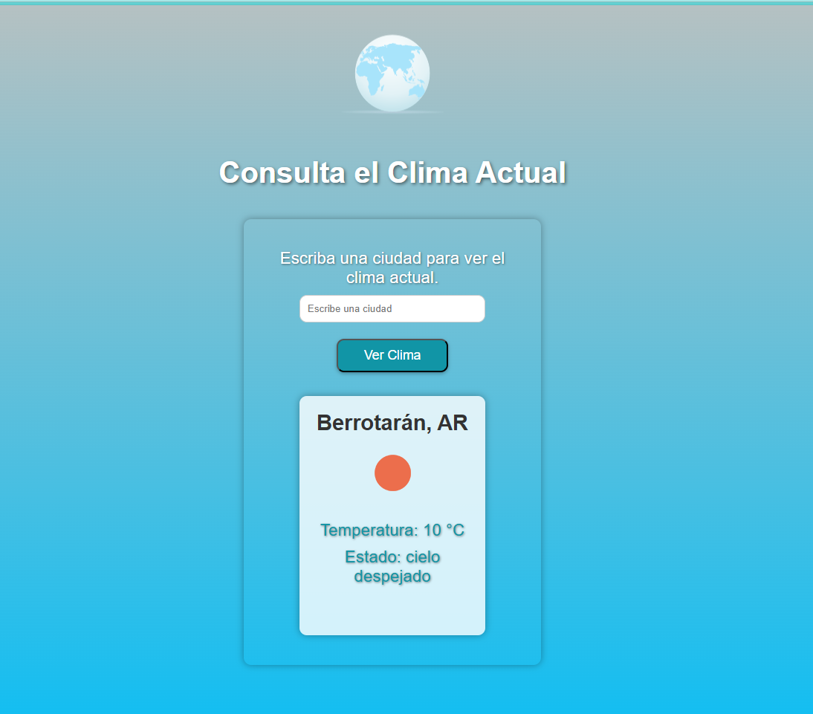

# 🌦 Consulta de Clima Actual / Current Weather Lookup

Este proyecto permite consultar el clima actual en cualquier ciudad del mundo utilizando la API de OpenWeatherMap. Fue desarrollado como parte del módulo de JavaScript para prácticas en consumo de APIs y manejo de eventos en el DOM.

This project allows users to check the current weather in any city worldwide using the OpenWeatherMap API. It was built as part of a JavaScript module to practice API consumption and DOM event handling.

---

## 🛠️ Tecnologías / Technologies

- HTML
- CSS
- JavaScript
- OpenWeatherMap API

---

## 🚀 Funcionalidades / Features

- Ingreso de ciudad para ver el clima actual.
- Visualización de:
  - Temperatura en °C.
  - Descripción del estado del clima.
  - Nombre de la ciudad y país.
- Actualización dinámica sin recargar la página.

---

## 📦 Cómo usar / How to Use

1. Clona este repositorio / Clone this repo:

   ```bash
   git clone https://github.com/MaVe1000/WeatherApi.git

   ```

2. Abre el archivo index.html en tu navegador / Open index.html in your browser.

3. Escribe el nombre de una ciudad y haz clic en "Ver Clima" / Type a city name and click "Ver Clima".

---

## 🔐 API Key

Este proyecto ahora obtiene la clave API del servicio de backend desplegado en Render. Ya no es necesario registrarse para obtener una clave API de OpenWeatherMap ni modificar el archivo script.js. La conexión al servicio de OpenWeatherMap se gestiona de forma segura a través del backend.

This project now obtains the API key from the backend service deployed on Render. It is no longer necessary to register for an OpenWeatherMap API key or modify the script.js file. The connection to the OpenWeatherMap service is securely managed through the backend.

---

## 📸 Ejemplo / Example



---

## ✍️ Autor / Author

💖 Desarrollado por María Verónica Rebolleda.

---

## 📄 Licencia / License

Este proyecto está bajo la Licencia MIT. This project is licensed under the MIT License.

---
